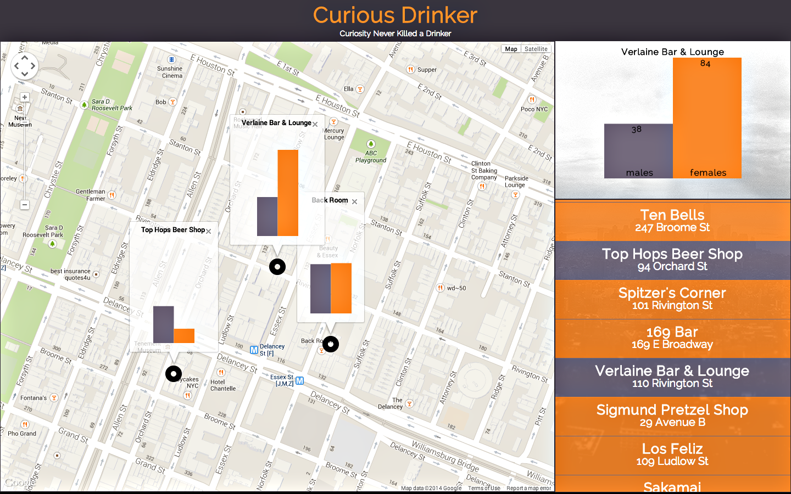

Curious Drinker
========

A data visualization app that shows Foursquare’s most popular bars in the Lower East Side and the gender ratio of their visitors. Curious Drinker uses Foursquare's API to pull realtime data daily, and visualizes data with the D3.js library. [curiousdrinker.herokuapp.com](Try it now)

## Technical specs
  - Back end: Ruby on Rails, Foursquare API.
  - Front end: Backbone.js, jQuery/AJAX, Google Maps API, D3.js